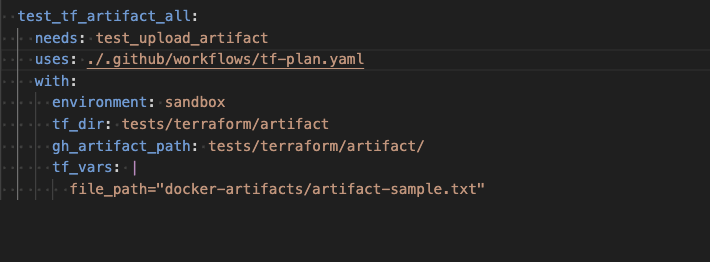

# Workflow Inputs

Workflows in GitHub Actions can be configured to accept inputs in two main ways: through direct inputs or by fetching inputs from repository or environment variables. Direct inputs allow you to pass specific values when triggering a workflow, such as setting the environment, branch names, or custom configuration parameters. This method provides immediate control over the execution of the workflow, making it ideal for cases where values need to be adjusted frequently.

Alternatively, workflows can pull inputs from predefined repository or environment variables. This approach allows for reusable configurations across multiple workflows, reducing the need to hard-code values directly in each workflow file. Environment variables can store things like version numbers, paths, or other non-sensitive project configurations, helping to standardize workflow behavior across different scenarios.

By combining both methods, you can create flexible workflows that either accept dynamic inputs or reuse predefined settings for consistent automation.

Inputs are assigned based on the following logic:

`TF_VARS: ${{ inputs.tf_vars || vars.tf_vars }}`

eg. if `inputs.tf_vars` is not set, it will default to `vars.tf_vars` and if `vars.tf_vars` is not set, it will default to `null`.
